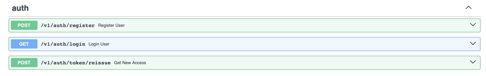
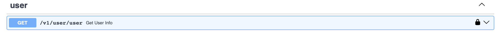
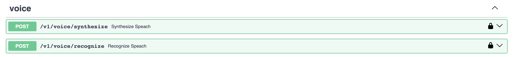
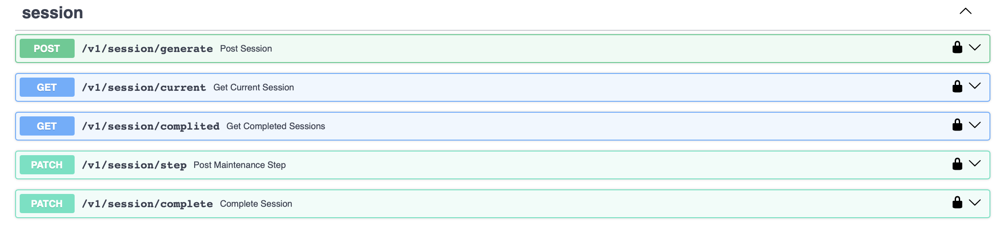
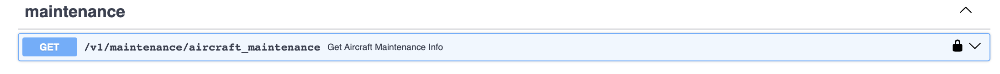
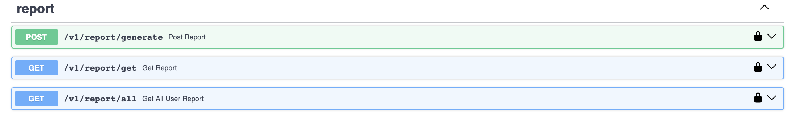
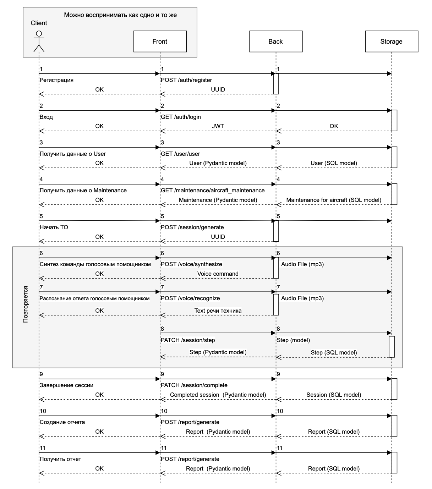
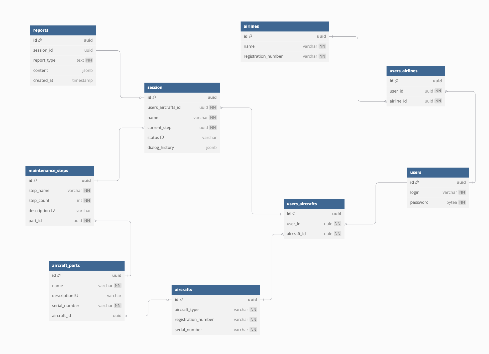

# voice_assistant_aircraft_maintenance

## Описание проекта


## Оглавление
- [Технологии](#технологии)
- [Структура проекта](#структура-проекта)
- [API ручки](#api-ручки)
- [Логика общения](#логика-общения)
- [Структура БД](#структура-бд)
- [Запуск проекта](#запуск-проекта)
- [Тестирование](#тестирование)
- [Документация](#документация)
- [Контакты](#контакты)

### Технологии
- **Python 3.12** — Язык программирования для разработки.
- **FastAPI** — Фреймворк для создания высокопроизводительных API.
- **Postgres** — СУБД для хранения данных.
- **Docker** — Контейнеризация для упрощения развертывания и изоляции сервисов.
- **SQLAlchemy** — ORM для работы с базой данных.
- **Alembic** — Инструмент для управления миграциями базы данных.
- **Uvicorn** — ASGI сервер для запуска приложения.
- **Asyncio** — Модуль для асинхронного программирования.
- **Dishka** — DI библиотека.

## Структура проекта
```
├── app/                    # Основной код приложения
│   ├── api/                # API эндпоинты
│   │   └── v1/             # Версия 1 API
│   ├── core/               # Основная логика и модули
│   │   ├── models/         # Pydantic и SQLAlchemy модели
│   │   ├── schemas/        # Protocols
│   ├── dependencies/       # DI
│   ├── middleware/         # Промежуточные обработчики
│   ├── repositories/       # Репозитории для работы с БД или другими хранилищами
│   ├── services/           # Логика бизнес-процессов
│   └── main.py             # Точка входа в приложение
├── tests/                  # Тесты
├── .env.example            # Пример конфигурации окружения
├── pyproject.toml          # Конфигурация проекта для Poetry
├── poetry.lock             # Зависимости Poetry
├── starts.sh               # Скрипт для запуска приложения (например, для Docker или локально)
├── test_data.sql           # Тестовые данные для БД
├── README.md               # Документация по проекту
├── docker-compose.yml      # Конфигурация Docker Compose
├── Dockerfile              # Dockerfile для сборки контейнера
```

## API ручки
- **POST `/auth/register`** — Регистрация пользователя.  
  Регистрирует нового пользователя, возвращает UUID зарегистрированного пользователя.
- **GET `/auth/login`** — Вход в аккаунт.  
  Выполняет аутентификацию пользователя, возвращает JWT токен для доступа.
- **POST `/auth/token/reissue`** — Получение нового доступа с помощью refresh токена.  
  Позволяет получить новый access токен, используя refresh токен.



- **GET `/user/user`** — Получение информации о пользователе.  
  Возвращает информацию о пользователе.



- **POST `/voice/synthesize`** — Синтез речи из текста.  
  Принимает текст и синтезирует речь на его основе.
- **POST `/voice/recognize`** — Распознавание речи.  
  Принимает аудиофайл, распознает речь и возвращает текст.



- **POST `/session/generate`** — Генерация новой сессии.  
  Создает новую сессию с данными, предоставленными пользователем.
- **GET `/session/current`** — Получение текущей сессии.  
  Возвращает информацию о текущей сессии пользователя.
- **GET `/session/complited`** — Получение всех завершенных сессий.  
  Возвращает список завершенных сессий пользователя.
- **PATCH `/session/step`** — Обновление информации о шаге завершенного обслуживания.  
  Обновляет информацию о текущем шаге в процессе завершенной сессии обслуживания.
- **PATCH `/session/complete`** — Завершение текущей сессии.  
  Завершает текущую сессию и возвращает результат.



- **GET `/maintenance/aircraft_maintenance`** — Получение информации о техническом обслуживании самолета.  
  Возвращает список деталей, подлежащих обслуживанию, для указанного регистрационного номера самолета.



- **POST `/report/generate`** — Генерация и добавление отчета после завершения сессии.  
  Создает новый отчет по данным отчета, переданным в теле запроса.
- **GET `/report/get`** — Получить отчет по session_id или report_id.  
  Возвращает отчет, соответствующий переданному session_id или report_id. Один из параметров может быть передан в запросе.
- **GET `/report/all`** — Получить все отчеты пользователя.  
  Возвращает список всех отчетов для текущего пользователя.



# Логика общения


# Структура БД


## Запуск проекта

1. **Клонируйте репозиторий:**
   ```bash
   git clone https://github.com/CostGamer/voice_assistant_aircraft_maintenance.git
   cd voice_assistant_aircraft_maintenance
   ```
2. **Создайте и настройте `.env` файл:**
   Скопируйте `.env.example` в `.env` и заполните необходимые переменные окружения.
3. **Запустите сервисы с помощью Docker:**
   ```bash
   docker-compose up -d
   ```
4. **Примените миграции базы данных:**
   ```bash
   docker-compose exec ... alembic upgrade head
   ```
5. **Сервисы будут доступны по следующим адресам:**
   - `api`: http://localhost:8000


## Тестирование

1. **Настройте параметры подключения в файле** `tests/__init__.py`
2. **Накатите миграции на тестовую БД**
3. **Запустите тесты**:
    ```bash
    pytest -p no:warnings -v #без warning
    ```
    ```bash
    pytest -v 
    ```

## Документация

- [Swagger API](http://localhost:8000/docs)


## Контакты

Если у вас возникли вопросы или предложения, можете связаться по почте: `vladimirbryzgalov00@gmail.com`.